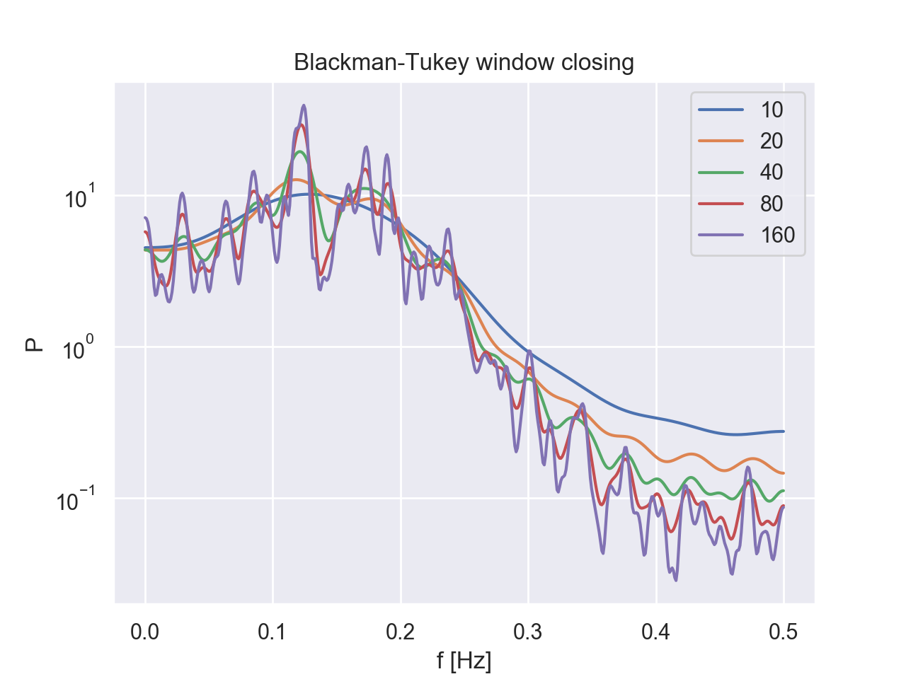

# Spectral Estimation
Various algorithms for spectral estimation. Based on the book "Modern Spectral Estimation - Theory & Application", Steven M. Kay.

Methods implemented as a part of this project:

1. Classical Methods
    * Periodogram
    * Averaged Periodogram
    * Blackman-Tukey Method
    
2. Parametric Methods
    * Autocorrelation Method
    * Covariance Method
    * Modified Covariance Method
    * Burg Method
    
## What's the difference between the classical and parametric methods?
    
Classical spectral estimation methods are based on the Fourier analysis.

On the other hand, it can be shown that if we know a model of a system -- which produces the given signal by propagating white noise -- we can estimate the signal’s PSD. Therefore, all parametric methods consist of choosing an appropriate model and estimating its parameters, along with substituting them into the theoretical PSD expressions.

The results for one classical and one parametric method are shown below.

|  | |
|:---:|:---:|
| Average Periodogram Method Estimation | Covariance Method Estimation |

## How to choose the right parameters for these methods?
    
It's very important to choose the right parameters for an accurate estimation.

"Window closing" is a method for determining a suitable window size for the Blackman-Tukey spectral estimator. On the other hand, all of the prametric methods have a problem of determining a proper order of a model -- p. Criterions that address this problem, FPE, AIC and CAT, are all implemented in this projects, and could be found in the ```source/utils/ModelOrderSelector.py``` file.

|  | |
|:---:|:---:|
| Window closing on Blackman-Tukey Method | Order Selection Illustrated |

# How to run the tests?

To run any test, simply go to the directory above 'source' and type in the following command in your terminal.

  ```shell
  python -m source.test.test_script
  ```

The test script can be one of the testing scripts from the directory 'test':

- ```test_classical``` - To test all the Classical Methods
- ```test_parametric``` - To test all the Parametric Methods

If you want to test all implemented solutions for the tasks in the statement, simply go to the directory above 'source' and type in:

```shell
  python -m source.test.task
  ```
